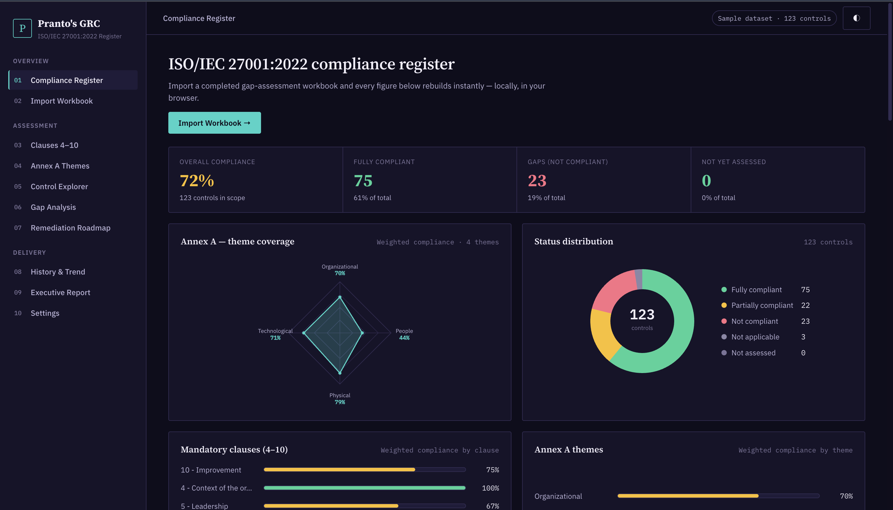
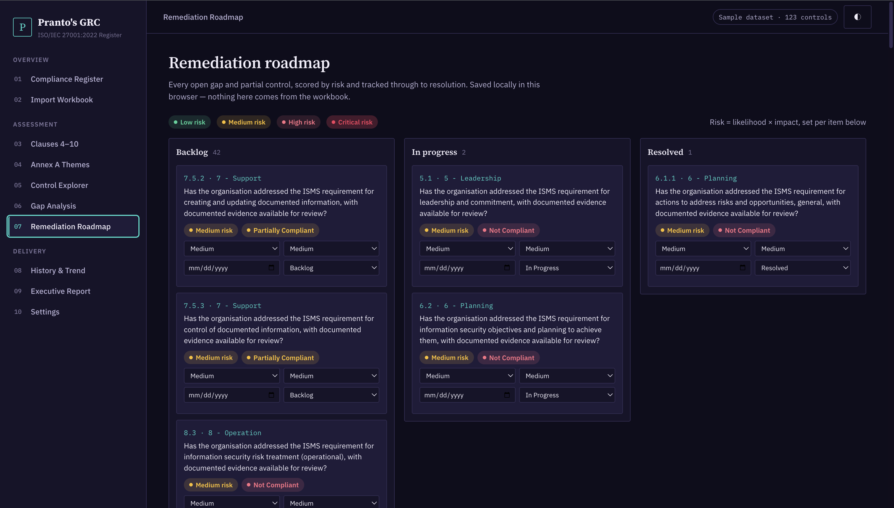
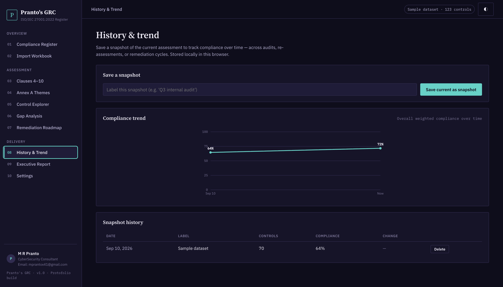

# Pranto's GRC — ISO/IEC 27001:2022 Compliance Register

A single-page, dependency-light dashboard for tracking an ISO/IEC 27001:2022 gap
assessment: import a workbook, and every chart, table, and report rebuilds
instantly, entirely in the browser.

Built as a portfolio piece with **plain HTML, CSS, and JavaScript** — no build
step, no framework, no backend.

Click on the live demo : https://mizanpranto.github.io/ISO-IEC-27001-2022-compliance-register/

Check the demo & you are welcome to do any contribute. 






## Features

- **Compliance register (dashboard)** — KPI summary, an Annex A theme radar
  chart, a status-distribution donut, weighted-compliance bars per clause and
  theme, a full compliance matrix, and a "needs attention" table — all
  rendered with hand-rolled SVG, no charting library.
- **Import workbook** — drag-and-drop or browse for a `.xlsx` / `.xls` / `.csv`
  gap-assessment file. Headers are matched flexibly (case- and
  spacing-insensitive) against a documented expected structure, with a parse
  log that flags blank references, duplicates, and unrecognised compliance
  values.
- **Clauses 4–10 / Annex A themes** — canonical ISO structure with per-section
  weighted compliance, expanded to show every control's requirement, status,
  owner, priority, and notes.
- **Control explorer** — search and filter every clause and control by
  category, section, and status, with CSV export.
- **Gap analysis** — simple, transparent, rule-based findings (weakest
  sections, unassessed controls, high-priority gaps). No external AI/LLM call
  is made — the logic is all in `js/app.js`.
- **Remediation roadmap** — every open gap becomes a Kanban card (Backlog /
  In Progress / Resolved), scored by likelihood × impact into a Low–Critical
  risk rating, with an owner-assignable due date. Persisted in
  `localStorage`, independent of whatever workbook is currently loaded.
- **History & trend** — save timestamped snapshots of the assessment and
  watch overall compliance move over time on a line chart, with a
  point-to-point delta table (re-assessment, audit cycle, remediation
  sprint, etc.).
- **Backup & restore** — export the full local state (dataset + roadmap +
  snapshot history) as one portable JSON file, and restore it later or on
  another machine.
- **Executive report** — a print-ready, one-page compliance summary
  (`window.print()` → Save as PDF).
- **Light / dark theme**, persisted with `localStorage`.

## Getting started

No build tooling required.

```bash
git clone <this-repo>
cd iso-sentinel
python3 -m http.server 8080   # or any static file server
# open http://localhost:8080
```

You can also just open `index.html` directly in a browser — the only
network calls are two font/library CDNs (Google Fonts and SheetJS via
cdnjs); everything else, including all data processing, runs locally.

A ready-to-import example file is included at
`sample-data/iso27001-sample-assessment.csv`, or click **Load sample
assessment** on the Import Workbook screen.

## Project structure

```
index.html            Page shell + all views
css/styles.css         Design system & layout (ledger/register aesthetic)
js/catalog.js          Canonical ISO 27001:2022 clause & Annex A control list
js/data.js              Fictional demo dataset used for "Load sample assessment"
js/charts.js            Dependency-free SVG radar/donut chart helpers
js/app.js               State, parsing, rendering, navigation
sample-data/            Downloadable example workbook (CSV)
```

## Workbook format

Pranto Shield looks for a sheet with these columns (flexible header matching):

| Column | Notes |
|---|---|
| Category | `Mandatory Clauses` or `Annex A Controls` |
| Section | e.g. `4 - Context of the organization`, `A.5 - Organizational controls` |
| Standard Ref | clause or control number, e.g. `6.1.2`, `A.8.7` |
| Assessment Question | the requirement text |
| Compliance | `Fully Compliant` / `Partially Compliant` / `Not Compliant` / `Not Applicable` |
| Notes, Owner, Priority | optional |

Any catalog control not present in the uploaded file is shown as **Not
Assessed** rather than being dropped — the register always reflects the full
93-control / 27-clause ISO 27001:2022 structure.

## What makes this more than a viewer

A gap-assessment dashboard that only ever reflects whatever file is loaded
right now is useful for a single review meeting and not much else. Pranto Shield
adds the two things a GRC team actually needs between assessments:

- a place to **act** on gaps (the roadmap), with risk scoring so the list is
  triaged rather than flat, and
- a way to **prove progress** over time (snapshots + trend), so "we improved
  compliance from 61% to 84% over two quarters" is a chart, not a claim.

Both are backed by nothing more than `localStorage` and a JSON export, on
purpose — no server, no accounts, no lock-in.

## Notes

- This is an independent portfolio project inspired by the concept of
  browser-based ISO 27001 gap-assessment dashboards. It is not affiliated
  with ISO/IEC, and the bundled sample data is entirely fictional.
- Control titles follow the published ISO/IEC 27001:2022 Annex A numbering
  and short names for reference purposes; assessment question text is
  original wording, not reproduced from the standard.

## License

MIT — do whatever you like with it.
